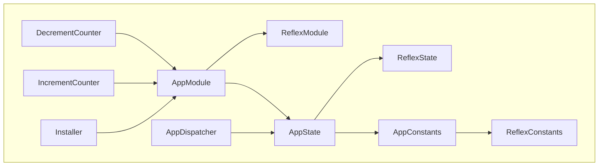

# Reflex Template

Template for getting started with [Reflex](https://github.com/Chroma-Org/Reflex), a Solidity framework for upgradeable modularized applications.

## Table of Contents

- [Table of Contents](#table-of-contents)
- [Contracts](#contracts)
- [Usage](#usage)
  - [Install Commands](#install-commands)
  - [Build Commands](#build-commands)
  - [Test Commands](#test-commands)
- [Safety](#safety)
- [Contributing](#contributing)
- [Acknowledgements](#acknowledgements)
- [License](#license)

## Contracts

```
.
├── abstracts
│   ├── AppConstants.sol
│   ├── AppModule.sol
│   └── AppState.sol
├── AppDispatcher.sol
└── modules
    ├── DecrementCounter.sol
    ├── IncrementCounter.sol
    └── Installer.sol
```



## Usage

To install Foundry:

```sh
curl -L https://foundry.paradigm.xyz | bash
```

This will download foundryup. To start Foundry, run:

```sh
foundryup
```

For convenience we use a [Makefile](/Makefile) for running different tasks.

### Install Commands

| Command                  | Action                    |
| ------------------------ | ------------------------- |
| `make` or `make install` | Install all dependencies. |

### Build Commands

Build profiles: `default`, `via-ir`.

Usage: `PROFILE=default make build`.

| Command                                      | Action                                            |
| -------------------------------------------- | ------------------------------------------------- |
| `make build` or `PROFILE=default make build` | Compile all contracts with the `default` profile. |
| `make clean`                                 | Delete all cached build files.                    |

### Test Commands

Build profiles: `default`, `via-ir`.

Test profiles: `default`, `intense`.

Usage: `PROFILE=default make test`.

| Command                                    | Action                                    |
| ------------------------------------------ | ----------------------------------------- |
| `make test` or `PROFILE=default make test` | Run all tests with the `default` profile. |

## Safety

This is **experimental software** and is provided on an "as is" and "as available" basis.

We **do not give any warranties** and **will not be liable for any loss** incurred through any use of this codebase.

At this point in time Reflex **has not yet been audited** and must therefore not yet be used in production.

## License

Licensed under the [GPL-3.0-or-later](/LICENSE) license.
